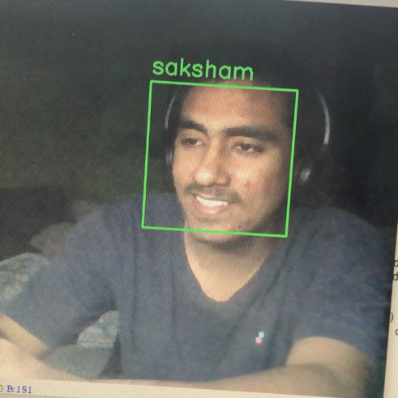

# Face-Classification

According to wikipedia  
Face detection is a computer technology that identifies human faces in digital images.  
Face-detection algorithms focus on the detection of frontal human faces. It is analogous to image detection in which the image of a person is matched bit by bit. Image matches with the image stores in database. Any facial feature changes in the database will invalidate the matching process. 
### How the program works
1. [Extracting Faces from Picture](Face-Extraction.py) 
Faces are identified and extracted in the form of an array by using the MTCNN model

2. [Creating Facial Embeddings](Face-Embedding.py) 
A facenet model is used to create Facial-Embeddings of the extracted faces

3. [Training a Classifier](Classification-Model.py) 
A SVM Classifier is used to predict label of a face based on the training data (facial-embeddings of different faces)

4. [Final Model using OpenCV](Final model.py) 
Haar-Cascade Classifier of OpenCV is used to detect faces using webcam and then classify it by using the above methods.

#### An accuracy between 90-96% was achieved when used on a small training set of 2 classes containing 3 pictures each

